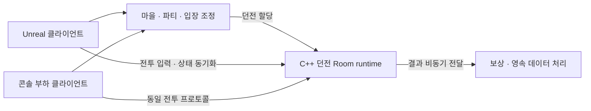

# C++ MO Game Project

**파티 단위 던전 플레이를 위한 C++ 권위 서버와 Unreal 클라이언트를 만드는 게임 서버 포트폴리오 프로젝트입니다.**

엔진 독립 서버의 상태 소유권과 동시 실행 구조를 직접 설계하고, 부하·응답성·정합성을 측정으로 검증합니다.

## 프로젝트 목표

> 마을 → 파티 구성 → 던전 입장 → 전투·목표 수행 → 보상 → 마을 복귀

- **플레이 흐름 구현:** 서버가 이동·공격·피격·쿨다운·보상을 검증하는 MO 액션 RPG를 구현합니다.
- **부하 편차에 대응:** 여러 던전을 병렬 실행하면서 특정 던전의 과부하와 서버 전체의 포화를 구분해 대응합니다.
- **재현 가능한 검증:** Unreal 샘플로 플레이를 확인하고, UI 없는 콘솔 클라이언트로 실제 프로토콜의 부하와 응답성을 측정합니다.

## 개발 방향

기능 개수보다 **경계의 정확성과 측정 가능성**을 우선합니다.

| 원칙 | 의미 |
| --- | --- |
| 상태 소유권을 먼저 정의한다 | 모든 상태에 유일한 변경 주체를 둡니다. 네트워크 콜백에서 게임 상태를 직접 바꾸지 않고 명령과 완료 이벤트로만 연결합니다. |
| 의존성보다 계약을 먼저 검증한다 | transport·DB에 독립적인 실행·종료·소유권 계약을 동시성으로 검증한 뒤 외부 라이브러리를 선택합니다. |
| 측정으로 설계를 고른다 | 평균이 아니라 p99·p99.9 분포와 실패율을 봅니다. 두 설계를 같은 조건에서 돌려 비교합니다. |
| 제안과 결정을 구분한다 | 실험 전 가정치를 확정 사양처럼 쓰지 않습니다. |

## 목표 아키텍처

전투의 권위 상태는 **엔진 독립 C++ 서버**가 소유합니다. Unreal은 입력·화면 표현·예측과 보정을 담당합니다. 마을·파티·영속 데이터 처리와 던전 시뮬레이션은 책임을 분리하며, 배포 단위는 검증 결과에 따라 확장합니다.



| 설계 주제 | 접근 방식 |
| --- | --- |
| 상태 소유권 | 같은 Room의 상태 변경은 한 번에 하나의 실행 흐름만 담당합니다. |
| 실행 예약 | Room을 특정 스레드에 영구 고정하지 않고 공유 worker 풀에서 실행합니다. |
| 과부하 제어 | 명령 큐 크기와 한 번의 실행량을 제한합니다. 단일 Room의 계산 비용과 노드 수용량은 별도로 관리합니다. |
| 비동기 경계 | 네트워크 I/O·DB 대기가 시뮬레이션을 막지 않도록 명령과 완료 이벤트로 연결합니다. |
| 콘텐츠 제작 | 공통 원본에서 서버·클라이언트 데이터를 생성하고 schema·참조·버전을 검증합니다. |
| 성능 검증 | tick 지연, 입력 응답 p99, 큐 포화, 종료·장애 시 정합성을 확인합니다. |

## 현재 구현 범위

C++20·CMake·표준 스레드 라이브러리만 사용하며 외부 런타임 의존성은 없습니다.

**[Room runtime](server/runtime/room_runtime.cpp)** — transport·DB·게임 규칙에 독립적인 실행 기반입니다.

- **단일 실행권:** 같은 Room의 명령과 tick은 동시에 실행되지 않습니다. 대신 Room을 스레드에 고정하지 않아, 먼저 비는 worker가 준비된 Room을 가져가 실행합니다.
- **명령 큐 상한:** Room마다 대기 명령 수에 상한이 있습니다. 가득 차면 새 명령을 받지 않고 호출자에게 `full`을 반환합니다. 재시도할지 포기할지는 호출자가 정하며, 서버가 명령을 임의로 지우지 않습니다.
- **generation handle:** 종료된 Room의 slot을 재사용할 때 세대 번호를 올립니다. 이전 세대의 handle로 도착한 명령은 `stale_handle`로 거절해, 끝난 Room에 보낸 입력이 같은 자리에 새로 만든 Room에 적용되는 것을 막습니다.
- **실행 예산:** 한 번의 실행에서 처리할 명령 수와 시간에 상한을 둡니다. 상한에 닿으면 남은 명령을 큐 뒤로 보내고 실행권을 넘깁니다. 명령이 몰린 Room 하나가 다른 Room의 실행 순서를 막지 않습니다.
- **tick 예약:** dt를 고정해 논리 시간을 전진시킵니다. 기한을 넘긴 tick은 한 번의 실행에서 한 번만 보충하고, 연속으로 밀리면 다음 보충을 뒤로 미룹니다. 밀린 tick을 한꺼번에 몰아서 실행하지 않습니다.
- **종료와 예외:** 종료 요청이 오면 아직 실행하지 않은 대기 명령을 폐기하고 그 개수를 `discarded`로 집계해 드러냅니다. 게임 로직에서 던진 예외는 해당 Room만 실패 종료시키고 다른 Room의 실행에는 영향을 주지 않습니다.

**[측정 계층](server/runtime/latency_histogram.hpp)** — Room별로 ready 대기, 입력 대기, tick 지연, tick 실행 시간, slice 실행 시간의 분포를 기록합니다. 최댓값 하나만 보면 p99 같은 상위 분위수를 알 수 없기 때문입니다. 실행 중 메모리를 할당하지 않는 고정 크기 히스토그램이며 버킷 오차는 6.25% 이하입니다.

**[측정 하네스](server/apps/room-runtime-bench/main.cpp)** — 서버 응답과 무관하게 정해진 시각에 입력을 보내는 부하 생성기입니다. 응답을 받고 나서 다음 입력을 보내면 서버가 느려질 때 부하도 같이 줄어 과부하가 지표에 드러나지 않습니다. 비싼 Room을 어느 worker에 배치할지 지정해 편향 부하를 재현하고, 정상 Room과 과부하 Room을 나눠서 보고합니다.

**실행 모델 비교 스위치** — 공유 큐(채택 모델)와 스레드 고정 배치(비교 기준)를 같은 실행 계약 위에서 대조합니다.

`room-runtime-demo`는 합성 명령과 tick을 처리하는 프로세스 내부 실행 예제입니다.

**[프로토콜](shared/protocol/)과 [transport](shared/transport/)** — 서로 의존하지 않는 두 라이브러리로 나눴습니다. 프로토콜은 메시지를 바이트로 바꾸는 일만 하고 소켓을 모릅니다. transport는 연결과 프레임 경계만 다루고 메시지 의미를 모릅니다. 그래서 전송 라이브러리를 바꿔도 메시지 정의는 그대로고, 부하 봇은 이 둘만 링크해 서버 코드 없이 붙습니다.

- **경계 검사:** 모든 읽기가 남은 길이를 확인합니다. 잘린 프레임은 첫 번째 짧은 필드에서 실패하고, 남은 바이트가 있는 프레임도 거절합니다. 보낸 쪽과 받는 쪽이 메시지를 다르게 알고 있다는 뜻이기 때문입니다.
- **필드 목록 한 벌:** 메시지마다 필드를 한 곳에만 선언하고, 쓰기와 읽기가 같은 목록을 순회합니다. 인코딩과 디코딩을 따로 쓰면 한쪽만 고쳐도 컴파일이 통과하고 런타임에 어긋나는데, 그 경우를 없앱니다.
- **enum 거절:** 전송된 enum은 상대가 보낸 정수입니다. 선언하지 않은 값을 캐스팅하면 이후 모든 분기가 예측 불가가 되므로, 유효 값 목록에 없으면 프레임을 거절합니다. 목록을 빠뜨리면 컴파일되지 않습니다.
- **소수를 보내지 않음:** 위치·각도는 정수로 양자화해 보냅니다. NaN은 모든 비교가 거짓이라 범위 검증을 그냥 통과하고, 부동소수 연산 차이로 서버 판정과 클라이언트 예측이 갈릴 수 있습니다.
- **강타입 식별자:** 세션·엔티티·파티 id가 모두 64비트 정수라, 하나를 다른 자리에 넘기면 컴파일은 통과하고 오동작합니다. 타입을 나눠 컴파일 에러로 만듭니다.
- **고정 리틀엔디안:** 구조체를 그대로 복사하지 않습니다. 패딩과 호스트 바이트 순서가 전송 형식에 새어 들어가면 다른 기기에서 다르게 읽힙니다.
- **프레이밍:** TCP는 바이트만 전달하므로 한 번 읽기에 프레임 절반이 오거나 세 개 반이 옵니다. 길이 접두사로 경계를 복원하고, 한도를 넘는 길이를 선언하면 다음 경계를 알 수 없으므로 연결을 끊습니다. **경계 복원이지 무결성 검증이 아닙니다** — payload 바이트가 유실되면 프레이밍만으로는 잡히지 않고, 그건 인증 암호화 계층의 몫입니다.
- **양방향 역압:** 송신 버퍼와 수신 버퍼 모두에 상한이 있습니다. 송신만 제한하면 읽지 않는 상대의 수신 버퍼로 옮겨 쌓일 뿐이라, 한 연결이 노드 전체의 메모리를 먹습니다. 수신이 가득 차면 읽기를 멈추고, 그 정체가 송신 측 `would_block`으로 돌아옵니다.
- **loopback transport:** 소켓과 스레드 없이 메모리로 주고받는 구현입니다. 테스트가 바이트를 언제 몇 개씩 옮길지 직접 정하므로 재조립 버그가 100번에 한 번이 아니라 매번 드러납니다. 나중에 문제가 생겼을 때 프로토콜 버그인지 소켓 버그인지 가르는 기준이기도 합니다.

버전은 연결 시 handshake에서 한 번만 협상합니다. 패킷마다 버전을 실으면 한 연결 안에서 바뀌지도 않는 값에 대역폭을 계속 쓰게 됩니다.

이동·전투·snapshot 메시지와 양자화 스케일은 아직 없습니다. 모양과 단위가 파티 인원·전투 공간에 달려 있는데, 이건 클라이언트 배포 후 바꿀 수 없는 영역이라 정해진 뒤에 올립니다.

### 검증

macOS Debug/Release 및 sanitizer 구성에서 각각 **CTest 30개 통과**, 컴파일 경고 없음. ThreadSanitizer는 각 케이스를 10회 반복해 총 300회에서 데이터 레이스 진단이 없었습니다. Windows/Linux는 CI 실행 대기입니다.

검증 대상은 실제로 실패할 수 있는 경계입니다.

| 검증 | 확인하는 것 |
| --- | --- |
| 다중 producer | 스레드 6개가 명령 12,000개를 보낼 때 수락 수와 적용 수, ID 집합이 일치하는가 |
| 단일 실행권 | 같은 Room의 명령과 tick이 겹쳐 실행되는 순간이 한 번도 없는가 |
| 병렬 진행 | 서로 다른 Room은 동시에 실행되는가 |
| 실행 순서 | 명령이 몰린 Room이 다른 Room의 차례를 독점하지 않는가 |
| wakeup 유실 | 실행이 끝나는 순간 도착한 명령이 아무도 깨우지 않은 채 큐에 남지 않는가 |
| 수명 | 큐가 가득 찬 상태로 종료할 때 폐기 수가 맞는가, slot 재사용 후 이전 handle이 거절되는가 |
| 종료 경쟁 | 여러 스레드가 동시에 종료를 호출해도 집계가 어긋나지 않는가 |
| tick | 고정 dt와 연속된 tick 번호를 유지하면서 밀린 tick의 보충을 제한하는가 |
| 예외 격리 | 한 Room의 예외가 다른 Room의 실행에 번지지 않는가 |
| 측정 계약 | 히스토그램 버킷 경계와 분위수가 정확한가, 표본 수가 실행 횟수와 일치하는가 |
| 하네스 회계 | Room 여러 개를 동시에 돌린 뒤 수락·처리·폐기 수의 합이 맞는가 |
| 전송 형식 | 다른 기기에서도 같은 바이트로 읽히는가 (고정 리틀엔디안) |
| 잘린 입력 | 메시지를 어느 길이에서 잘라도 거절하는가 |
| 알 수 없는 값 | 모르는 메시지 id와 상태 값을 추측하지 않고 거절하는가 |
| 프레임 재조립 | 바이트를 한 개씩 흘려보내도 보낸 프레임이 그대로 복원되는가 |
| 과대 프레임 | 한도를 넘는 길이 선언에 버퍼를 키우지 않고 연결을 끊는가 |
| 역압 | 읽지 않는 상대 때문에 송신 버퍼가 무한히 자라지 않는가 |
| 무결성 한계 | 프레이밍이 payload 유실을 못 잡는다는 사실이 코드와 일치하는가 |
| 수신 버퍼 상한 | 읽지 않는 상대에게 계속 보내도 수신 측 메모리가 자라지 않는가 |
| enum 전수 검사 | 0~255 모든 값 중 선언한 것만 통과하는가 |
| 양자화 | NaN·무한대·int64 경계 초과를 거절하고, 각도가 wrap 후에도 복원되는가 |

### 측정 결과: 실행 모델 비교

Room 64개 / worker 4개 / 60 Hz / 12초. 비싼 Room 4개(8배 비용)를 고정 배치 모델의 한 worker로 몰았을 때, **영향을 받지 않아야 할 정상 Room**의 tick 지연입니다.

| 실행 모델 | p50 | p90 | p99 | 입력 처리 지연 p99 | 기한 초과 Room |
| --- | --- | --- | --- | --- | --- |
| 공유 worker 풀 | 0.035 ms | 1.2 ms | 1.5 ms | 1.7 ms | 0 |
| 스레드 고정 배치 | 0.043 ms | 1245 ms | 3932 ms | 23.6 ms | 16 |

균일 부하에서는 두 모델이 사실상 같았습니다(tick 지연 p99 0.083 ms 대 0.119 ms). 공유 풀은 균일 부하에서 손해 없이 편향 부하에서만 이득이었습니다. 다만 한 worker의 수요가 1코어를 넘으면 스케줄링으로 해결되지 않고, 전체가 포화하면 공유 풀도 같은 결과가 됩니다.

> 합성 비용 모델, 개발 머신(macOS, Apple silicon 14코어), 단일 실행 기준입니다. 전투·직렬화 비용과 네트워크 구간이 빠져 있어 서비스 수용량 수치가 아닙니다.

## 프로젝트 구조

```text
mo-game-project/
  CMakeLists.txt
  CMakePresets.json         # macOS/Windows/Linux 구성과 sanitizer 프리셋
  cmake/                    # 공통 빌드·toolchain 확인
  shared/
    protocol/               # 메시지 정의와 바이트 변환 (소켓 의존 없음)
    transport/              # 프레이밍·연결·loopback (메시지 의미 모름)
  server/
    runtime/                # Room 실행기, 명령 큐, 지연 히스토그램
    apps/
      room-runtime-demo/    # 프로세스 내부 실행 예제
      room-runtime-bench/   # 부하·지연 측정 하네스
  tests/                    # 동시성·수명·측정 계약 검증
```

예정 구조입니다.

```text
  server/
    apps/edge-control/      # 계정·파티·입장 조정
    apps/world-worker/      # 마을·던전 실행 노드
    domain/                 # party, entry, run 정책
    persistence/            # transaction, 원장, outbox
  shared/
    core/                   # ID, clock, 공통 오류
    transport/asio/         # 실제 소켓 구현
    simulation/             # 엔진 독립 전투·목표
  clients/unreal/           # Unreal 샘플 클라이언트
  tools/load-client/        # 실제 프로토콜 부하 발생기
  data/ schemas/            # 버전 관리되는 던전·스킬·충돌 데이터
```

의존 방향을 빌드에서 강제합니다. `mo_protocol`과 `mo_transport`는 서로에게도, Room 실행기에도 의존하지 않습니다. 조립은 서버 앱과 봇이 합니다. `simulation`은 transport·DB·Unreal 헤더에 의존하지 않습니다. 네트워크 DTO와 시뮬레이션 명령은 경계에서 변환합니다. 서버는 CMake, Unreal은 Unreal Build Tool을 사용하며 모노레포 안에서 독립 빌드가 가능해야 합니다.

## 빌드

macOS에서 C++20을 지원하는 Apple Clang과 CMake 3.25 이상을 설치한 뒤 실행합니다.

```sh
cmake --preset macos-debug
cmake --build --preset macos-debug
ctest --preset macos-debug
./out/build/macos-debug/room-runtime-demo
```

`cmake/CheckToolchain.cmake`가 구성 단계에서 C++20 컴파일과 링크를 확인합니다. Windows는 `windows-msvc` 구성에 `windows-debug`/`windows-release` 빌드, Linux는 `linux-debug`/`linux-release`를 사용합니다.

실행 중 버그를 잡는 sanitizer 구성도 함께 준비했습니다.

| 프리셋 | 도구 | 잡는 문제 |
| --- | --- | --- |
| `macos-asan` | AddressSanitizer + UndefinedBehaviorSanitizer | 버퍼 오버런, 해제 후 사용, 메모리 누수, 정의되지 않은 동작 |
| `macos-tsan` | ThreadSanitizer | 두 스레드가 동기화 없이 같은 메모리에 접근하는 데이터 레이스 |

멀티스레드 코드의 데이터 레이스는 일반 테스트에서 우연히 통과하는 경우가 많습니다. ThreadSanitizer는 충돌이 실제로 발생하지 않아도 동기화가 빠진 접근 자체를 찾아내므로, Room 실행기를 만드는 동안 상시로 돌립니다.

실행 모델의 지연 분포를 비교하려면 Release 빌드의 측정 하네스를 사용합니다.

```sh
cmake --build --preset macos-release
./out/build/macos-release/room-runtime-bench --help

# 편향 부하: 비싼 Room을 고정 배치 모델의 한 worker로 집중
./out/build/macos-release/room-runtime-bench \
  --rooms 64 --workers 4 --duration-ms 12000 \
  --tick-hz 60 --input-hz 30 --tick-cost-us 500 --command-cost-us 100 \
  --hot-rooms 4 --hot-multiplier 8 --hot-layout collide \
  --placement shared --json report.json
```

`--placement`를 `shared`와 `fixed`로 바꿔 실행하면 위 비교 결과를 재현할 수 있습니다.

## 진행 계획

| 단계 | 내용 | 상태 |
| --- | --- | --- |
| P0 | 기술 위험 확인: transport 후보 실험, Unreal 연동 가능성, 플랫폼 빌드 | 진행 예정 |
| P1 | 런타임과 측정 기반: Room 실행기, 지연 분포, session 소유권, 부하 발생기 | 실행기·측정 완료 |
| P2 | UI 없이 끝까지 플레이: 파티·입장·전투·보상 영속화를 콘솔로 완주 | 미착수 |
| P3 | 부하와 장애를 포함한 수평 확장: Directory·lease·배치·drain·노드 장애 | 미착수 |
| P4 | Unreal 샘플 완성: 예측·보정·재접속 UX와 클라이언트 지표 | 미착수 |
| P5 | 서비스 준비: fuzz·soak·인증·배포·복구 runbook과 출시 게이트 | 미착수 |

다음 작업은 최소 플레이 범위 확정과 프로토콜·세션 설계, transport 후보의 작은 실험입니다.

## 아직 확정하지 않은 것

확정된 것은 엔진 독립 C++ 서버 + Unreal 클라이언트 구조와 개발 환경입니다. 아래는 측정·결정 전의 제안입니다.

- 네트워크 라이브러리(Asio / GameNetworkingSockets)와 패킷 직렬화 방식
- 파티 인원(4인 PvE 제안), tick rate(30/60 Hz 대조 예정), snapshot 주기
- 영속 계층(PostgreSQL 제안), 장애 시 던전 중단·입장 자원 복구 정책
- Room 실행기의 최종 구현 — 공유 worker 풀을 기준으로 후보를 비교할 예정
