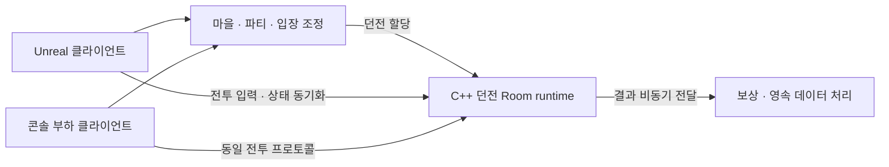

# C++ MO Game Project

**파티 단위 던전 플레이를 위한 C++ 권위 서버와 Unreal 클라이언트를 만드는 게임 서버 포트폴리오 프로젝트입니다.**

엔진 독립 서버의 상태 소유권과 동시 실행 구조를 직접 설계하고, 부하·응답성·정합성을 측정으로 검증합니다.

## 프로젝트 목표

> 마을 → 파티 구성 → 던전 입장 → 전투·목표 수행 → 보상 → 마을 복귀

- **플레이 흐름 구현:** 서버가 이동·공격·피격·쿨다운·보상을 검증하는 MO 액션 RPG를 구현합니다.
- **부하 편차에 대응:** 여러 던전을 병렬 실행하면서 특정 던전의 과부하와 서버 전체의 포화를 구분해 대응합니다.
- **재현 가능한 검증:** Unreal 샘플로 플레이를 확인하고, UI 없는 콘솔 클라이언트로 실제 프로토콜의 부하와 응답성을 측정합니다.

## 개발 방향

기능 개수보다 **경계의 정확성과 측정 가능성**을 우선합니다.

| 원칙 | 의미 |
| --- | --- |
| 상태 소유권을 먼저 정의한다 | 모든 상태에 유일한 변경 주체를 둡니다. 네트워크 콜백에서 게임 상태를 직접 바꾸지 않고 명령과 완료 이벤트로만 연결합니다. |
| 의존성보다 계약을 먼저 검증한다 | transport·DB에 독립적인 실행·종료·소유권 계약을 동시성으로 검증한 뒤 외부 라이브러리를 선택합니다. |
| 측정으로 설계를 고른다 | 평균이 아니라 p99·p99.9 분포와 실패율을 봅니다. 두 설계를 같은 조건에서 돌려 비교합니다. |
| 제안과 결정을 구분한다 | 실험 전 가정치를 확정 사양처럼 쓰지 않습니다. |

## 목표 아키텍처

전투의 권위 상태는 **엔진 독립 C++ 서버**가 소유합니다. Unreal은 입력·화면 표현·예측과 보정을 담당합니다. 마을·파티·영속 데이터 처리와 던전 시뮬레이션은 책임을 분리하며, 배포 단위는 검증 결과에 따라 확장합니다.



| 설계 주제 | 접근 방식 |
| --- | --- |
| 상태 소유권 | 같은 Room의 상태 변경은 한 번에 하나의 실행 흐름만 담당합니다. |
| 실행 예약 | Room을 특정 스레드에 영구 고정하지 않고 공유 worker 풀에서 실행합니다. |
| 과부하 제어 | 명령 큐 크기와 한 번의 실행량을 제한합니다. 단일 Room의 계산 비용과 노드 수용량은 별도로 관리합니다. |
| 비동기 경계 | 네트워크 I/O·DB 대기가 시뮬레이션을 막지 않도록 명령과 완료 이벤트로 연결합니다. |
| 콘텐츠 제작 | 공통 원본에서 서버·클라이언트 데이터를 생성하고 schema·참조·버전을 검증합니다. |
| 성능 검증 | tick 지연, 입력 응답 p99, 큐 포화, 종료·장애 시 정합성을 확인합니다. |

## 현재 구현 범위

C++20·CMake·표준 스레드 라이브러리만 사용하며 외부 런타임 의존성은 없습니다.

**[Room runtime](server/runtime/room_runtime.cpp)** — transport·DB·게임 규칙에 독립적인 실행 기반입니다.

- **단일 실행권:** 같은 Room의 명령과 tick은 동시에 실행되지 않습니다. 대신 Room을 스레드에 고정하지 않아, 먼저 비는 worker가 준비된 Room을 가져가 실행합니다.
- **명령 큐 상한:** Room마다 대기 명령 수에 상한이 있습니다. 가득 차면 새 명령을 받지 않고 호출자에게 `full`을 반환합니다. 재시도할지 포기할지는 호출자가 정하며, 서버가 명령을 임의로 지우지 않습니다.
- **generation handle:** 종료된 Room의 slot을 재사용할 때 세대 번호를 올립니다. 이전 세대의 handle로 도착한 명령은 `stale_handle`로 거절해, 끝난 Room에 보낸 입력이 같은 자리에 새로 만든 Room에 적용되는 것을 막습니다.
- **실행 예산:** 한 번의 실행에서 처리할 명령 수와 시간에 상한을 둡니다. 상한에 닿으면 남은 명령을 큐 뒤로 보내고 실행권을 넘깁니다. 명령이 몰린 Room 하나가 다른 Room의 실행 순서를 막지 않습니다.
- **tick 예약:** dt를 고정해 논리 시간을 전진시킵니다. 기한을 넘긴 tick은 한 번의 실행에서 한 번만 보충하고, 연속으로 밀리면 다음 보충을 뒤로 미룹니다. 밀린 tick을 한꺼번에 몰아서 실행하지 않습니다.
- **종료와 예외:** 종료 요청이 오면 아직 실행하지 않은 대기 명령을 폐기하고 그 개수를 `discarded`로 집계해 드러냅니다. 게임 로직에서 던진 예외는 해당 Room만 실패 종료시키고 다른 Room의 실행에는 영향을 주지 않습니다.

**[측정 계층](server/runtime/latency_histogram.hpp)** — Room별로 ready 대기, 입력 대기, tick 지연, tick 실행 시간, slice 실행 시간의 분포를 기록합니다. 최댓값 하나만 보면 p99 같은 상위 분위수를 알 수 없기 때문입니다. 실행 중 메모리를 할당하지 않는 고정 크기 히스토그램이며 버킷 오차는 6.25% 이하입니다.

`room-runtime-demo`는 합성 명령과 tick을 처리하는 프로세스 내부 실행 예제입니다.

## 프로젝트 구조

```text
mo-game-project/
  CMakeLists.txt
  CMakePresets.json         # macOS/Windows/Linux 구성과 sanitizer 프리셋
  cmake/                    # 공통 빌드·toolchain 확인
  server/
    runtime/                # Room 실행기, 명령 큐, 지연 히스토그램
    apps/room-runtime-demo/ # 프로세스 내부 실행 예제
```

예정 구조입니다.

```text
  server/
    apps/edge-control/      # 계정·파티·입장 조정
    apps/world-worker/      # 마을·던전 실행 노드
    domain/                 # party, entry, run 정책
    persistence/            # transaction, 원장, outbox
  shared/
    core/                   # ID, clock, 공통 오류
    protocol/               # 메시지 schema, codec, 버전
    transport/              # transport adapter, session
    simulation/             # 엔진 독립 전투·목표
  clients/unreal/           # Unreal 샘플 클라이언트
  tools/load-client/        # 실제 프로토콜 부하 발생기
  tests/ data/ schemas/
```

`simulation`은 transport·DB·Unreal 헤더에 의존하지 않습니다. 네트워크 DTO와 시뮬레이션 명령은 경계에서 변환합니다. 서버는 CMake, Unreal은 Unreal Build Tool을 사용하며 모노레포 안에서 독립 빌드가 가능해야 합니다.

## 빌드

macOS에서 C++20을 지원하는 Apple Clang과 CMake 3.25 이상을 설치한 뒤 실행합니다.

```sh
cmake --preset macos-debug
cmake --build --preset macos-debug
```

`cmake/CheckToolchain.cmake`가 구성 단계에서 C++20 컴파일과 링크를 확인합니다. Windows는 `windows-msvc` 구성에 `windows-debug`/`windows-release` 빌드, Linux는 `linux-debug`/`linux-release`를 사용합니다.

실행 중 버그를 잡는 sanitizer 구성도 함께 준비했습니다.

| 프리셋 | 도구 | 잡는 문제 |
| --- | --- | --- |
| `macos-asan` | AddressSanitizer + UndefinedBehaviorSanitizer | 버퍼 오버런, 해제 후 사용, 메모리 누수, 정의되지 않은 동작 |
| `macos-tsan` | ThreadSanitizer | 두 스레드가 동기화 없이 같은 메모리에 접근하는 데이터 레이스 |

멀티스레드 코드의 데이터 레이스는 일반 테스트에서 우연히 통과하는 경우가 많습니다. ThreadSanitizer는 충돌이 실제로 발생하지 않아도 동기화가 빠진 접근 자체를 찾아내므로, Room 실행기를 만드는 동안 상시로 돌립니다.

## 아직 확정하지 않은 것

확정된 것은 엔진 독립 C++ 서버 + Unreal 클라이언트 구조와 개발 환경입니다. 아래는 측정·결정 전의 제안입니다.

- 네트워크 라이브러리(Asio / GameNetworkingSockets)와 패킷 직렬화 방식
- 파티 인원(4인 PvE 제안), tick rate(30/60 Hz 대조 예정), snapshot 주기
- 영속 계층(PostgreSQL 제안), 장애 시 던전 중단·입장 자원 복구 정책
- Room 실행기의 최종 구현 — 공유 worker 풀을 기준으로 후보를 비교할 예정
